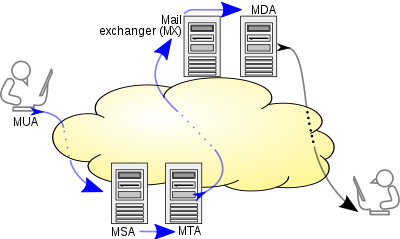
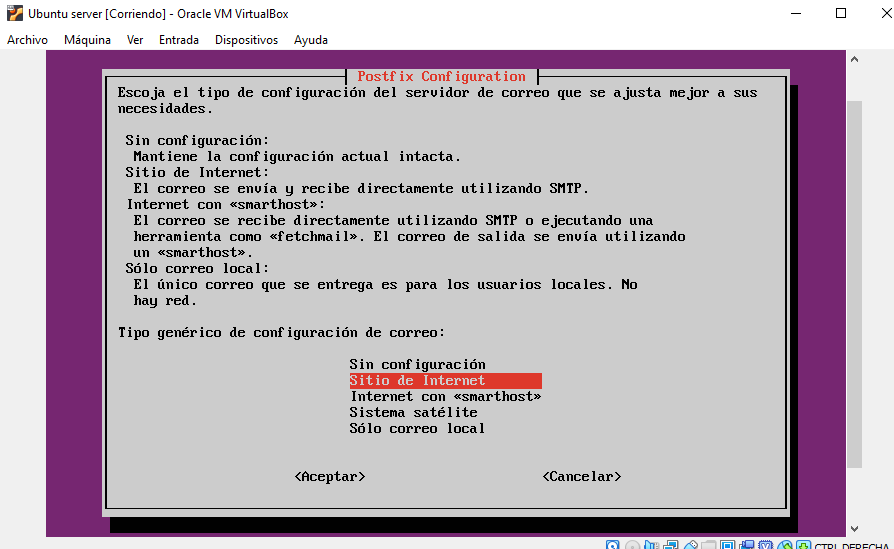
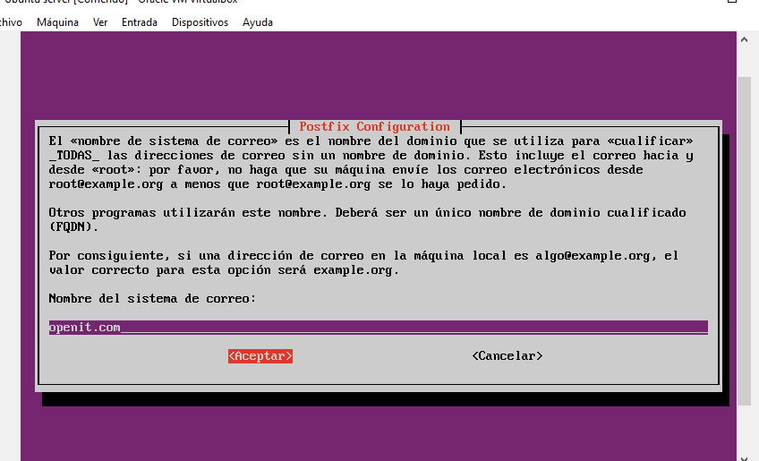
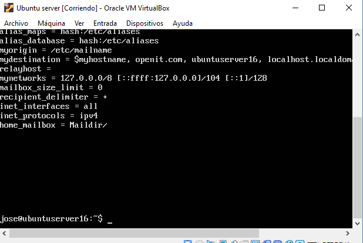
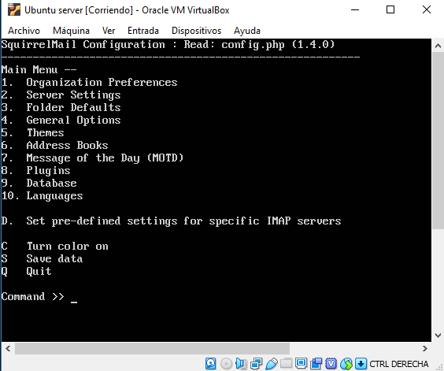
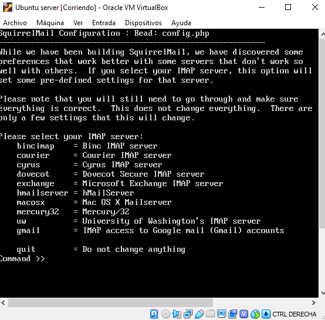
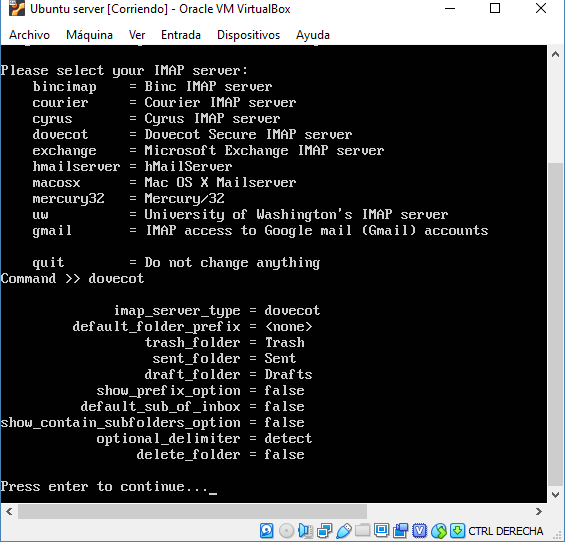
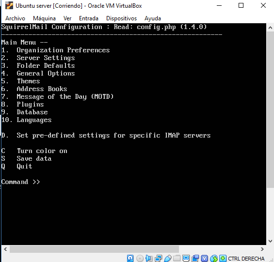
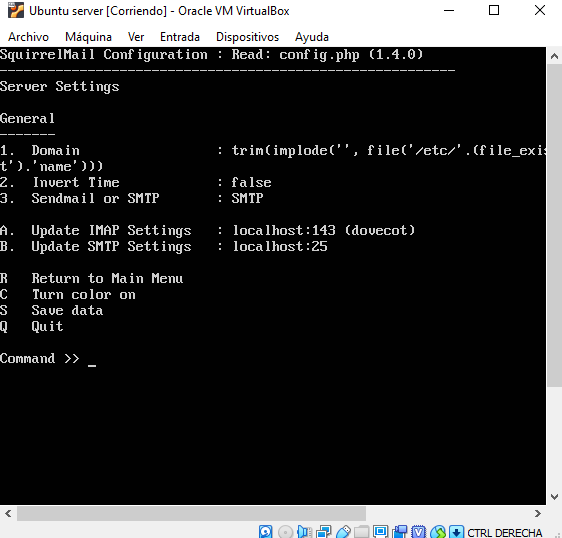
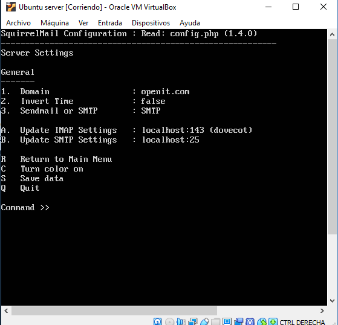

# Configuración de un servidor SMTP con Squirrelmail

### Introducción
Los sistemas que gestionan el e-mail utilizan tres protocolos principales:

* ***SMTP*** para la tarea específica de enviar el correo (correo saliente)
* ***POP3 o IMAP*** para recibir el correo entrante.

### SMTP

El protocolo para transferencia simple de correo (en inglés Simple Mail Transfer Protocol o SMTP) es un protocolo de red
utilizado para el intercambio de mensajes de correo electrónico entre computadoras u otros dispositivos (PDA, teléfonos 
móviles, impresoras, etc). 

El funcionamiento de este protocolo se da en línea, de manera que opera en los servicios de correo electrónico. 
Sin embargo, este protocolo posee algunas limitaciones en cuanto a la recepción de mensajes en el servidor de destino 
(cola de mensajes recibidos). Como alternativa a esta limitación se asocia normalmente a este protocolo con otros, como 
el POP o IMAP, otorgando a SMTP la tarea específica de enviar correo, y recibirlos empleando los otros protocolos antes 
mencionados (POP O IMAP). 

[Más información sobre SMTP.](https://es.wikipedia.org/wiki/Protocolo_para_transferencia_simple_de_correo)
 
### IMAP

El protocolo IMAP (Internet Message Access Protocol, o Protocolo de acceso a mensajes de internet) no descarga los 
mensajes a tu ordenador: tanto los mensajes como las carpetas que hayamos creado se mantienen en el servidor.
    
    Esto es ventajoso cuando nos conectamos para leer nuestro correo desde diferentes dispositivos, por ejemplo, nuestro
    portátil o el smartphone: sabemos que siempre podremos acceder a todos nuestros mensajes, y que el buzón estará actualizado.
    También es interesante para preservar nuestra privacidad cuando leemos nuestro correo desde un ordenador de uso público 
    o compartido, ya que no almacena información en la máquina local.

El protocolo IMAP es el más aconsejable cuando accedemos a nuestros correos desde varios dispositivos, o en movilidad.
Como precaución, hemos de borrar periódicamente el contenido de nuestra cuenta para que no exceda del límite de espacio 
concedido. El inconveniente de este protocolo es que siempre hemos de disponer de conexión a internet, incluso para 
acceder y trabajar con los mensajes antiguos.

### POP3

El protocolo POP3 (Postal Office Protocol, o protocolo de oficina postal versión 3) descarga los mensajes de correo en 
nuestro ordenador (u otro dispositivo), donde quedan almacenados y organizados en las carpetas que hayamos creado. 
Una vez que se han bajado del servidor, los correos sólo serán accesibles desde la máquina a la que lo hayamos bajado, 
ya que por defecto, al descargarse los mensajes, éstos quedan eliminados del servidor.

Es ideal para conectarse siempre desde un mismo ordenador, y además ofrece la ventaja de poder acceder a nuestros mensajes 
antiguos (ya descargados) sin necesidad de tener conexión a internet.

    La elección entre IMAP o POP3, una vez conocidas las ventajas e inconvenientes de cada protocolo, se deja a elección del 
    usuario. Una solución usual es utilizar el POP3 en nuestro ordenador principal del trabajo, o en nuestro ordenador 
    personal de casa y descargar en ellos los correos para gestionar mejor su almacenamiento. En movilidad, o para consultar 
    el correo desde otros ordenadores, podemos usar el IMAP.

### Instalación y configuración en Ubuntu Server

A la hora de iniciar la instalación podría ser recomendable realizar una actualización de todos los paquetes del sistema.
Ayudándonos del comando ***`sudo apt-get update`*** realizaríamos esta operación.

#### Apache2
A continuación habría que instalar apache2 si es que no está instalado. Para ello habría que usar ***`sudo apt-get install apache 2`*** .

#### Postfix

Hecho esto, el siguiente paso sería instalar [Postfix](https://es.wikipedia.org/wiki/Postfix) .
Para ello nos ayudamos del comando ***`sudo apt-get install postfix`*** .

Tal como se muestra en la imagen nos informan de varias opciones por lo que habrá que seleccionar la opción sitio de internet.

En la siguiente pantalla pedirá que se escriba el dominio del correo de electrónico en este caso sera openit.com

Al aceptar el nombre del sistema de correo iniciará la carga de las configuraciones básicas, terminado se debe ejecutar
el comando ***`sudo nano /etc/postfix/main.cf`*** .Esto abre un archivo de configuración de Postfix y se va al final 
del archivo y se revisa que las líneas ahi vistas tengan los mismos valores.

Al terminar la configuración ***`sudo /etc/init.d/postfix restart`*** para reiniciar Postfix.

#### Dovecot

Instalado y configurado Postfix hay que proceder a instalar [Dovecot](https://www.dovecot.org/) .Para ello utilizaremos 
el comando ***`sudo apt-get install dovecot-imapd dovecot-pop3d`*** . No obstante hay que tener en cuenta que puede darnos algún error a la hora
de la instalación como por ejemplo ***http //security.ubuntu.com/ubuntu xenial-security/main amd64***. Se puede consultar
[documentación externa de ubuntu](https://ubuntuforums.org/showthread.php?t=2377056) para solventar este tipo de inprevistos.

### Instalación de Squirrelmail

Una vez preparado el entorno por medio de los pasos anteriores ya se podría instalar [Squirrelmain](http://squirrelmail.org/).
Para ello nos ayudaremos del comando ***`sudo apt-get install squirrelmail`*** .

Hecha la instalación procederemos a la configuración, para ello ejecutaremos ***`sudo squirrelmail-configure`***

Como se aprecia en la imagen superior se abrirá un menú de opciones donde habrá que seleccionar la D.

Ahora en la lista de comandos se escribe ***dovecot*** para señalar el Dovecot Secure IMAP server que es el servidor que
se ha instalado anteriormente para su uso.

Se mostrará la configuración de Dovecot y se presiona enter para continuar.

En la siguiente opción habrá que seleccionar 2 y se presiona enter para entrar en Server Settings.

Entrado en Server Settings habrá que seleccionar la opción 1 para ingresar en la opción de Domain y a continuación habrá
que escribir el dominio por el que se desea en este caso openit.com y se escribe q para salir.

Nombrado el dominio habrá que retornar al Menú principal, opción R tal como se ve en la imagen superior y seleccionar la opción
11 ***Allow server-side sorting*** para cambiarla a True.

Hecho copiaremos en fichero de configuración por defecto al directorio apache2 para habilitar el acceso a la interfaz web.
Para ello utilizaremos el comando ***`sudo cp /etc/squirrelmail/apache.conf /etc/apache2/sites-available/squirrelmail.conf`***

Y posteriormente hablitarlo:
***`sudo a2ensite squirrelmail.conf`***

Hecho esto podremos acceder mediante el navegador web de nuestro equipo cliente a la interfaz de squirrelmail.

### Usuarios

Para comenzar a utilizar el correo web de Squirrelmail, habrá que crear un nuevo usuario, para ello habrá que ejecutar el 
comando ***`sudo useradd nombreusuario`*** y su contraseña mediante ***`sudo passwd nombreusuario`***

Posteriormente cree una carpeta de inicio para el usuario en /var/www/html/nombreusuario y haga que sea el directorio 
de inicio predeterminado.

Hecho esto regrese a la página de inicio de sesión de squirrelmail e ingrese el nombre de usuario y la contraseña del usuario creado 
recientemente.

Al loguearse puede que surja un error que puede ser por los permisos de usuarios por lo que habría que habilitar al usuario 
creado los permisos necesarios.

***`sudo chown -R nombreusuario:nombreusuario /var/www/html/nombreusuario`***

